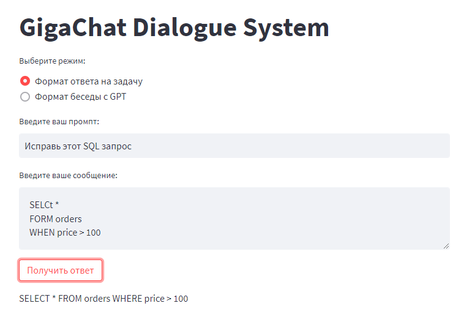
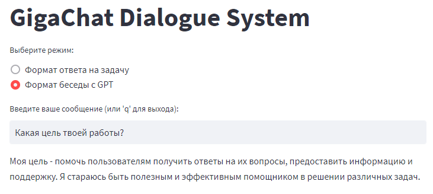

# GigaChatIntegration

> Реализация интеграции [GigaChat](https://developers.sber.ru/help/gigachat) через API.

- Python 3.8+
  - python-certifi-win32
  - requests
  - streamlit
 
## How to use

1) Склонировать репозиторий

```git clone https://github.com/GorokhovSemyon/GigaChatIntegration```

2) Предустановить сертификаты минцифры, либо отключить их проверку
3) Получить Client ID и Client Secret зарегестрировавшись/авторизировавшись по данной ссылке -> [API](https://developers.sber.ru/portal/products/gigachat-api)
4) Добавить полученные ключи, как "ClientID" и "ClientSecret" соответственно в переменные среды текущего пользователя
5) Установить необходимое для запуска в окружении (лучше в venv)

```pip install -r ./requirements.txt```

6) Запустить main.py, выбрать формат: 
- конкретной задачи(`1`)
- моделировать контекст последовательно(`2`)
- web-интерфейс(`3`)

## Веб-интерфейс

### Формат ответа на задачу


### Формат беседы

